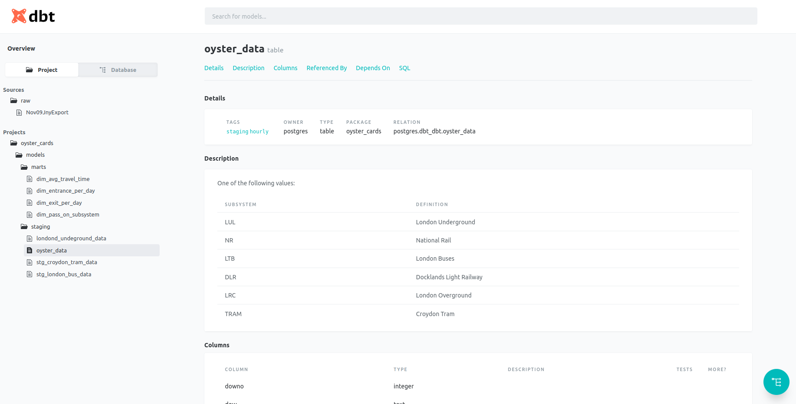

<h5>The study project made with Data Build Tool </h5>
Kaggle [Oyster cards dataset](https://www.kaggle.com/astronasko/transport-for-london-journey-information) was used for this project. 
Below you can see the screen from the dbt documentation screen of my project: 
 
 
Here you can see DAG for source, tables and views from my project: 
 
 