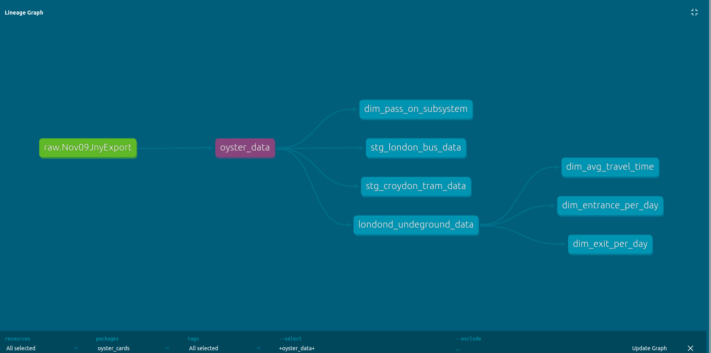

## The study project made with Data Build Tool

Kaggle [Oyster cards dataset](https://www.kaggle.com/astronasko/transport-for-london-journey-information) was used for this project.

Below you can see the screen from the dbt documentation screen of my project:

Here you can see DAG for source, tables and views from my project:

